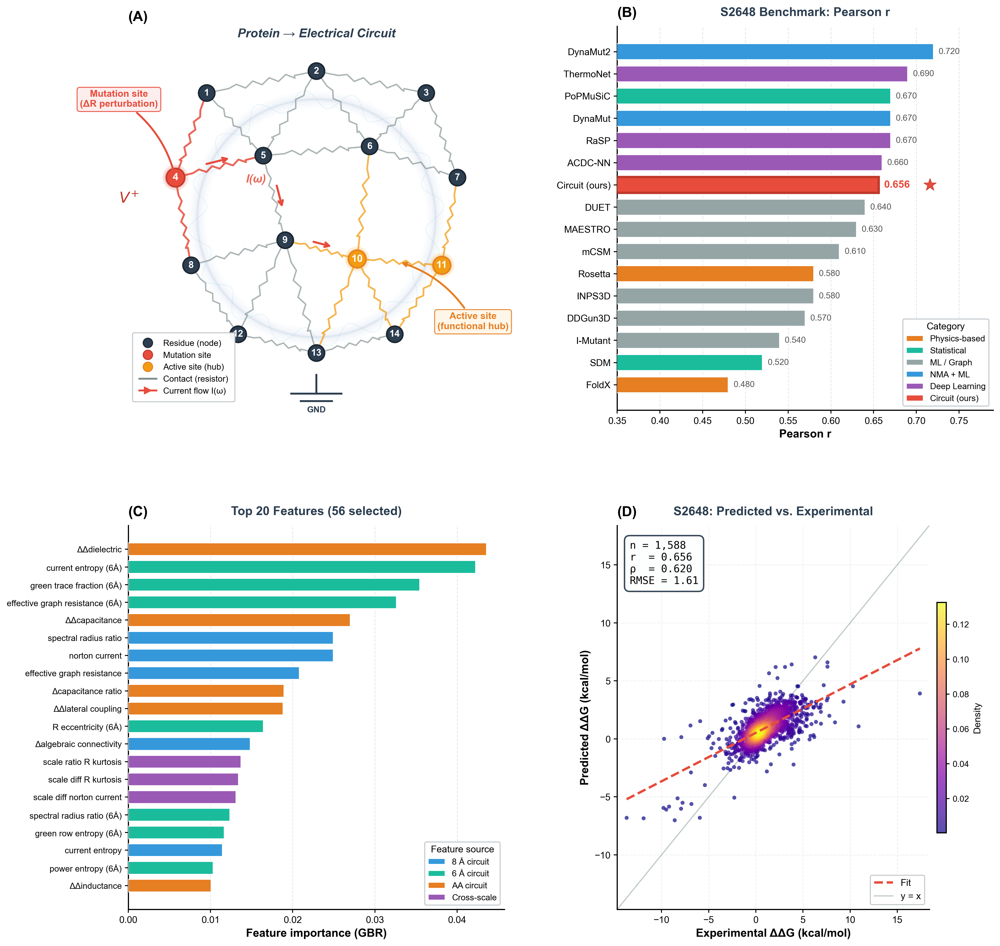

# Enzyme Resistance: Electrical Resistance Model of Mutation Propagation in Enzymes


## Overview

**Enzyme-Resistance** is a Python package that models mutation propagation through protein structures using **circuit theory**. Residues are nodes, non-covalent contacts are resistors (conductance-weighted edges), and mutations perturb resistor values at the mutation site. Effective resistance, Kirchhoff current flow, and spectral properties of the resulting circuit capture how a single-point mutation's effect propagates allosterically through the protein — enabling prediction of experimental ΔΔG (thermodynamic stability change).

This repository accompanies the manuscript:

> **Enzyme-Resistance: Predicting Mutation Effects on Protein Stability Using Electrical Circuit Theory**
>
> Harikrishna Sekar Jayanthan
>
> *(2026)*

<p align="center">
  
</p>

*Figure 1. **(A)** Protein-to-circuit mapping — residues as nodes, contacts as resistors, mutation as perturbation. **(B)** S2648 benchmark: Pearson r comparison with 15 published ΔΔG methods. **(C)** Top 20 circuit-theoretic features by Gradient Boosting importance. **(D)** Predicted vs. experimental ΔΔG (n = 1,588, r = 0.656, RMSE = 1.61 kcal/mol).*

---

## Key Concepts

| Concept | Circuit Analogy | Protein Meaning |
|---|---|---|
| **Node** | Junction | Amino acid residue (Cα) |
| **Edge weight** | Conductance (1/R) | exp(−d / λ) distance-decayed contact strength |
| **Effective resistance** R_eff(i,j) | Resistance between terminals | Allosteric communication distance |
| **Kirchhoff index** | Total network resistance | Overall protein rigidity |
| **Fiedler vector** | Bottleneck oscillation mode | Primary structural hinge |
| **Edge current** I = GΔV | Kirchhoff current | Information/force flow pathway |
| **Power dissipation** P = I²/G | Joule heating | Energetic bottleneck |
| **Mutation perturbation** | Resistor value change | Hydrophobicity + charge + volume shift |

---

## Feature Engineering: 83 Circuit-Theoretic Features in 16 Groups

| Group | # Features | Description |
|---|---|---|
| A. Resistance distance | 6 | ΔR_eff landscape shifts (active site, global, max, anisotropy) |
| B. Global circuit health | 4 | Kirchhoff index, λ₂ (algebraic connectivity), spectral gap |
| C. Current-flow centrality | 4 | Betweenness, closeness in resistance-distance space |
| D. Voltage / potential | 4 | L⁺ self-potential and transfer voltages (Green's function) |
| E. Spectral mode | 3 | Fiedler component, conductance degree |
| F. Current flow patterns | 12 | Kirchhoff edge currents, entropy, redistribution, concentration |
| G. Voltage transfer & coupling | 5 | Transfer ratio, mutual conductance, influence radius |
| H. Power dissipation | 5 | Joule heating landscape P = I²/G |
| I. Multi-scale resistance | 5 | Shells, commute time, path redundancy |
| J. Green's function propagator | 5 | L⁺ row entropy, anisotropy, trace fraction |
| K. Thévenin / Norton equivalent | 4 | Equivalent circuit parameters |
| L. Spectral circuit descriptors | 4 | Eigenvalue entropy, spectral radius ratio |
| M. Resistance distance geometry | 8 | Harmonic mean, median, skewness, kurtosis of R |
| N. Fold-change ratios | 5 | log₂(mut/wt) for key circuit quantities |
| O. Multi-scale extended | 4 | 3-hop shell, gradient, local/global ratio |
| P. Cross-feature products | 5 | Dimensionless physical combinations (V·G, I·R, etc.) |
| **Total** | **83** | |

---

## Benchmark Datasets

| Dataset | Mutations | Proteins | Source |
|---|---|---|---|
| **S2648** | 2,648 | ~130 | Dehouck et al. (PoPMuSiC 2.1) — standard benchmark |
| **FireProtDB** | ~7,000+ | ~500+ | Loschmidt Labs (Hugging Face) |
| **Built-in** | 89 | 7 | Curated subset for quick testing (no network required) |

---

## Comparison with 15 Published ΔΔG Prediction Methods

The benchmark compares our circuit model against established methods, each evaluated under its own published protocol:

| Category | Methods |
|---|---|
| Physics-based | FoldX 5, Rosetta cartesian_ddg |
| Statistical potential | PoPMuSiC 2.1, SDM |
| ML / Graph-based | mCSM, DUET, I-Mutant 3.0, MAESTRO, DDGun3D, INPS3D |
| NMA + Graph ML | DynaMut, DynaMut2 |
| Deep learning | ThermoNet, ACDC-NN, RaSP |

---

## Resistance-Based Cross-Validation (4 Strategies)

All models are evaluated on the **exact same pre-computed splits** so performance differences are purely due to the model:

| Strategy | Circuit Property | Description |
|---|---|---|
| Resistance Centrality Stratified | (n−1) / Σ R(i,j) | Stratified by current-flow closeness |
| Propagation Radius Stratified | # residues with significant ΔR | Balances local vs. global perturbations |
| Kirchhoff-Grouped | Σ R_eff (total network resistance) | Groups proteins by circuit topology |
| Spectral-Clustered | Fiedler vector component | Separates bottleneck-adjacent from core mutations |

---

## Repository Structure

```
enzyme-resistance/
├── README.md                           # This file
├── LICENSE                             # MIT License
├── pyproject.toml                      # Package metadata & dependencies
├── requirements.txt                    # Python dependencies
│
├── enzyme_resistance/                  # Python package
│   ├── __init__.py                     # Public API
│   ├── __main__.py                     # python -m enzyme_resistance
│   ├── cli.py                          # Command-line interface
│   ├── contact_graph.py                # Step 1: Build protein contact graph
│   ├── resistance.py                   # Step 2: Effective resistance (V=IR)
│   ├── mutation.py                     # Step 3: Model the mutation
│   ├── features.py                     # Step 4: 83 circuit-theoretic features
│   ├── train.py                        # Step 5: Train & evaluate predictors
│   ├── resistance_cv.py               # 4 resistance-based CV strategies
│   ├── benchmark.py                    # Full benchmarking pipeline
│   ├── published_baselines.py          # 15 published method baselines
│   └── data/
│       ├── __init__.py
│       └── downloader.py              # Dataset & PDB downloader
│
├── scripts/
│   ├── run_benchmark.py                # Run full benchmark
│   ├── run_s2648_benchmark.py          # S2648-specific benchmark
│   ├── generate_figure1.py             # Generate manuscript Figure 1
│   └── generate_manuscript.py          # Generate manuscript text
│
└── tests/
    ├── __init__.py
    └── test_basic.py                   # Unit tests (circuit, mutation, CV)
```

---

## Installation

```bash
# Clone the repository
git clone https://github.com/harikrishna11/enzyme-resistance.git
cd enzyme-resistance

# Install dependencies
pip install -r requirements.txt

# Install the package (editable mode)
pip install -e .
```

### Optional: Hugging Face dataset support (for FireProtDB)

```bash
pip install -e ".[hf]"
```

### Dependencies

- Python ≥ 3.9
- NumPy ≥ 1.24
- SciPy ≥ 1.10
- NetworkX ≥ 3.0
- Biopython ≥ 1.81
- pandas ≥ 2.0
- scikit-learn ≥ 1.3
- Matplotlib ≥ 3.7
- requests ≥ 2.28
- tqdm ≥ 4.65

---

## Usage

### Command-Line Interface

```bash
# Run full benchmark on all datasets
enzyme-resistance benchmark --dataset all

# Run benchmark on S2648 only (standard benchmark)
enzyme-resistance benchmark --dataset s2648

# Quick test with built-in 89-mutation dataset
enzyme-resistance benchmark --dataset builtin --max-mutations 50

# Analyze a single mutation on a PDB structure
enzyme-resistance analyze structure.pdb --mutation 42:V:A --chain A
```

### Python API

```python
from enzyme_resistance import (
    build_contact_graph,
    effective_resistance_matrix,
    apply_mutation,
    extract_resistance_features,
)

# Step 1: Build protein contact graph
G_wt, residues = build_contact_graph("1LZ1.pdb", cutoff=8.0)

# Step 2: Compute effective resistance matrix
R = effective_resistance_matrix(G_wt)

# Step 3: Apply a mutation (V42A)
from enzyme_resistance.contact_graph import get_residue_index
site = get_residue_index(residues, 42)
G_mut = apply_mutation(G_wt, site, "V", "A")

# Step 4: Extract 83 circuit-theoretic features
features = extract_resistance_features(G_wt, G_mut, site)
print(f"ΔR to active site: {features['delta_R_active_site']:.4f}")
print(f"Propagation radius: {features['propagation_radius']:.0f} residues")
print(f"Current redistribution: {features['current_redistribution']:.4f}")
```

### Full Benchmark Pipeline

```python
from enzyme_resistance.benchmark import run_benchmark

results = run_benchmark(
    dataset="all",           # s2648, fireprotdb, builtin, or all
    output_dir="results/",
    n_folds=5,
    run_ablation=True,
    run_sensitivity=True,
)
```

### Resistance-Based Cross-Validation

```python
from enzyme_resistance.resistance_cv import precompute_all_splits

# Pre-compute splits once — all models use these exact splits
all_splits = precompute_all_splits(X, y, n_splits=5, groups=protein_ids)

for cv_name, splits in all_splits.items():
    print(f"{cv_name}: {len(splits)} folds")
    for train_idx, test_idx in splits:
        # train and evaluate your model
        pass
```

---

## Pipeline Architecture

```
Phase 1 — Download ALL datasets + PDB structures (cached to disk)
    │
Phase 2 — For each dataset:
    ├── Build 83-dimensional circuit features (V=IR + P + RC + G(s))
    ├── Pre-compute 4 resistance-based CV splits
    ├── Evaluate 8 model types × 4 CV strategies (same splits)
    ├── Feature ablation study (drop-one-feature & drop-one-group)
    └── Conductance sensitivity study (exponential vs inverse² vs binary)
    │
Phase 3 — Compare against 15 published ΔΔG methods
    │
Phase 4 — Generate plots (heatmaps, scatter, bar charts, landscape)
```

### 8 Model Types Evaluated

| Model | Type |
|---|---|
| Gradient Boosting | Tree ensemble |
| Random Forest | Tree ensemble |
| Extra Trees | Tree ensemble |
| Ridge | Linear (L2) |
| Elastic Net | Linear (L1+L2) |
| Lasso | Linear (L1) |
| SVR (RBF kernel) | Kernel method |
| Stacking (GBR+RF+ET+SVR → Ridge) | Meta-ensemble |

---

## Mutation Perturbation Model

A mutation at residue *k* changes the physicochemical properties of that node, altering the conductance of all incident edges:

```
perturbation = 1.0 + α·Δhydrophobicity + β·|Δcharge| + γ·Δvolume
new_conductance = old_conductance × perturbation
```

| Parameter | Property | Scale | Default |
|---|---|---|---|
| α | Kyte–Doolittle hydrophobicity | −4.5 … +4.5 | 0.1 |
| β | Formal charge at pH 7 | 0 … 2 | 0.3 |
| γ | Zamyatnin side-chain volume (ų) | 0 … 170 | 0.002 |

---

## Tests

```bash
# Run all tests
pytest

# Run with verbose output
pytest -v

# Run specific test class
pytest tests/test_basic.py::TestEffectiveResistance
```

---

## Citation

If you use this package or data, please cite:

```bibtex
@article{jayanthan2026enzyme_resistance,
  title   = {Enzyme-Resistance: Predicting Mutation Effects on Protein Stability Using Electrical Circuit Theory
},
  author  = {Jayanthan, Hari},
  year    = {2026}
}
```

---

## License

This project is licensed under the MIT License — see [LICENSE](LICENSE) for details.

---

## Contact

**Harikrishna Sekar Jayanthan**
Senior Scientist, Evotec UK / Syngene BBRC Bangalore
haricoolguy111@gmail.com
GitHub: [@harikrishna11](https://github.com/harikrishna11)
